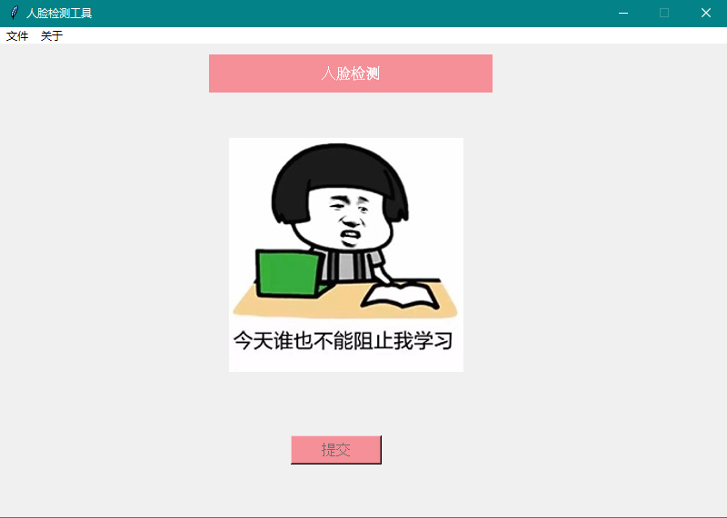
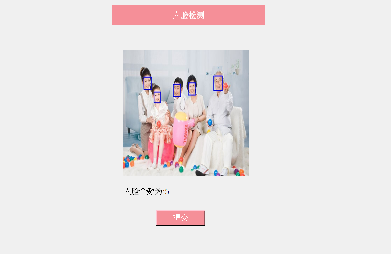
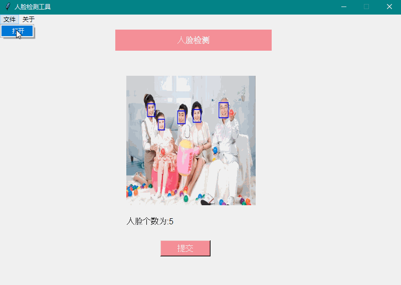

# Python-用tkinter实现人脸检测小工具


前面我们分别学习了python的tkinter图形库和人脸检测方法，今天我们就动手写一个小工具，将两者结合起来。实现起来不难，但是多动手总是好的嘛！

程序我已经写好了，长下面这个样子.... 是不是有点似曾相识...  (请原谅我的偷懒)



不过话说回来了，我们写程序，好看是一方面，更重要的还是理解代码里面的逻辑。

首先简单介绍一下程序的功能吧：程序刚打开的时候，上面有一个标题，代表咱写的是一个人脸检测程序，首页是一张欢迎图，底下是一个提交的按钮，一开始是灰色的不可点击的状态，然后左上角有两个菜单，文件和关于，文件下面又有一个二级菜单'打开'，点击它可以选择一张图片，加载进来会替换掉首页的欢迎图。

好了，下面介绍怎么实现吧。

首先导入所有需要的包

```python
from tkinter import *
from PIL import Image, ImageTk
import tkinter.messagebox
import tkinter.filedialog
import dlib
import cv2
import time
import os
```

然后还是一样，程序框架先搭好

```python
from tkinter import *

class Picture(object):
   def __init__(self, init_window_name):
       self.window = init_window_name
   def init_window(self):
       self.window.geometry('800x520+500+100')  # 设置窗口的大小
       self.window.resizable(0, 0)  # 防止用户调整尺寸
  	   self.window.title("人脸检测工具")
       self.window.mainloop()
if __name__ == "__main__":
   windows = Tk()
   picture = Picture(windows)
   picture.init_window()
```

实现里面的UI:

```python
self.menubar = Menu(self.window)
self.filemenu = Menu(self.window, tearoff=0)
self.aboutmenu = Menu(self.window, tearoff=0)
self.menubar.add_cascade(label='文件', menu=self.filemenu)
self.menubar.add_cascade(label='关于', menu=self.aboutmenu)
self.filemenu.add_command(label='打开', command=self.select_file)
self.aboutmenu.add_command(label='版本号: 1.0')
self.aboutmenu.add_command(label='作者: Humy')
self.welcome = Label(self.window, text='人脸检测', fg='white', bg='#f58f98', font=('Arial', 12), width=34,height=2).place(x=230, y=10)

self.img_open = Image.open(self.welcome_path).resize((258, 258))
self.image = ImageTk.PhotoImage(self.img_open)
self.label_img = Label(self.window, image=self.image)
self.label_img.place(x=250, y=100)
self.var_path = StringVar()
self.path = Label(self.window, textvariable=self.var_path,
                  highlightcolor='red', font=('Arial', 12), height=1).place(x=250, y=380)

self.submit = Button(self.window, text='提交', font=('Arial', 12), fg='white', width=10, height=1,command=self.submit_cmd, bg='#f58f98', state=DISABLED)

self.submit.place(x=320, y=430)
self.window.config(menu=self.menubar)
```

其中‘打开文件’的点击事件，定义如下：

```python
def select_file(self):
    self.filename = tkinter.filedialog.askopenfilename()
    img_open = Image.open(self.filename).resize((258, 258))
    image = ImageTk.PhotoImage(img_open)
    self.label_img.configure(image=image)
    self.label_img.image = image
    self.submit['state'] = NORMAL
```

`tkinter.filedialog.askopenfilename()`函数返回的是选择的图片路径，以字符串的格式返回，`self.submit['state'] = NORMAL`,这句代码的意思是，当用户选择了图片文件，提交按钮就置为可点击的状态。

提交按钮的点击事件，定义如下:

```python 
def submit_cmd(self):
    save_filename, info = self.face_detect(self.filename)
    if save_filename != '':
        img_open = Image.open(save_filename).resize((258, 258))
        info = "人脸个数为:"+str(info)
        self.var_path.set(info)
        image = ImageTk.PhotoImage(img_open)
        self.label_img.configure(image=image)
        self.label_img.image = image
    else:
        self.var_path.set(info)
```

点击提交按钮会调用该函数，该函数内部又调用了`face_detect`人脸检测方法.

```python
def face_detect(self, img_path):
    detector = dlib.get_frontal_face_detector()
    img = self.load_img(img_path)
    faces = detector(img, 1)
    face_nums = len(faces)
    if face_nums > 0:
        for face in faces:
            cv2.rectangle(img, (face.left(), face.top()), (face.right(), face.bottom()),                              (0, 0, 255), 2)
            t = time.localtime(time.time())
            timeInfo = '{}{}{}{}{}{}.jpg'.format(t.tm_year, t.tm_mon, t.tm_mday,                                       t.tm_hour, t.tm_min, t.tm_sec)
            save_file = os.path.join('./face', timeInfo)
            cv2.imwrite(save_file, cv2.cvtColor(img, cv2.COLOR_RGB2BGR))
            return save_file, face_nums
    else:
        info = '没有发现人脸！'
        return '', info
```

到此为止，整个程序就实现完成了，下面看看效果吧。



再来看看没有人脸的情况




最后要说的是，tkinter是基于Tk的Python库。这是Python官方采用的标准库，优点是作为Python标准库、稳定、发布程序较小，缺点是控件相对较少。还有一种是基于QT的图形库（Pyside2和PyQt5），该库的优点是控件比较丰富、跨平台体验好、文档完善、用户多。缺点是 库比较大，发布出来的程序比较大。

所以说，如果你要开发一个功能比较简单的小工具，推荐使用tkinter。如果要开发功能复杂的，大型的项目或者商业项目还是推荐去学习一下QT。